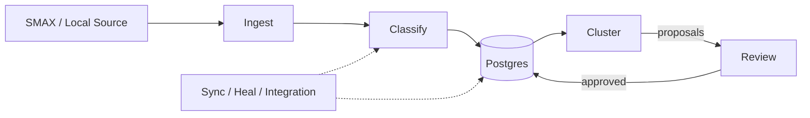

# ARCHITECTURE — AI Incident Classifier

## Service flow

## Service blocks (one folder per pipeline stage)

| Service | What it does | Folder |
|---|---|---|
| **App** | FastAPI wiring: lifespan, CORS, exception handlers, router mounting, worker startup | `ai_classification/app.py` |
| **API** | Endpoint-only modules (no business logic): incidents, reports, diagnostics, integration (E1-E9) | `ai_classification/api/` |
| **Classify** | LLM classification cascade (system → service → offering), taxonomy validation, frozen prompts (drift-guarded), persistence orchestration | `ai_classification/services/classify/` |
| **Cluster** | v2 LLM-first persistent clustering: Flow A/B/C (assign / sweep / audit), grouping, Arabic naming | `ai_classification/services/cluster/` |
| **Match** | Offering-key helpers only (`offering_of`, `embed_pure`, `OFFERING_000`) — the dormant sub-offering engine moved to `legacy/` | `ai_classification/services/match/` |
| **Review** | Human gate for persistent clusters (cluster proposals + taxonomy gaps review APIs) | `ai_classification/services/review/` |
| **Jobs** | Background workers: sync, heal sweep (gated), async ingest worker; integration E1-E9 job store | `ai_classification/services/jobs/` |
| **Ingest** | Import service + status monitor (endpoints moved to `api/`) | `ai_classification/services/ingest/` |

**Shared infrastructure** (not services): `ai_classification/shared/` — `db.py` (pool/DDL/embeddings), `store.py` (IncidentStore facade + singleton), `store_incidents.py`, `store_clusters.py`, `store_logs.py`, `config.py` (env-based, fail-loud).

**Seams**: `ai_classification/seams/` — port.py, local_source.py, pipeline.py (the SMAX client + models moved to `integrations/smax/`).

**Domain**: `ai_classification/domain/` — shared models (ClassificationResult, SimilarMatch, SimilarOpenIncident, taxonomy).

**Legacy**: `legacy/suboffering_engine/` — the quarantined sub-offering engine (superseded by persistent clustering), preserved for resurrection; nothing in the running app imports it.

## Where do I look?

| Symptom | Service |
|---|---|
| Wrong offering / service picked | `services/classify/` (cascade + validator) |
| LLM calls fail / slow / wrong key | `services/classify/llm.py`, `shared/config.py` |
| Ticket not joining a cluster | `services/cluster/persistent.py` (Flow A/B/C) |
| Cluster names wrong / English / stale | `services/cluster/` (LLM Arabic naming) |
| Proposals stuck or minting | `services/review/` + `frontend/dashboard/review.html` |
| Fallback/offering-less tickets | `services/jobs/heal.py` (gated re-classify sweep) |
| Async ingest job stuck (retryable/flagged) | `services/jobs/integration/` + `api/integration.py` |
| DB / persistence / pool issues | `shared/store.py` + `shared/db.py` |
| API returns wrong status / auth | `app.py` + `api/integration.py` |
| SMAX / ticketing connectivity | `integrations/smax/` (separate process) |
| Old sub-offering engine behavior | `legacy/suboffering_engine/` (dormant) |

## Contracts

Each service folder has a `CONTRACT.md` (input / output / dependencies / callers / invariants / entry point):

- `services/jobs/CONTRACT.md`, `services/review/CONTRACT.md`
- `services/cluster/CONTRACT.md`, `services/match/CONTRACT.md`
- `services/classify/CONTRACT.md`, `services/ingest/CONTRACT.md`, `shared/CONTRACT.md`

## Tests

Mirror the services: `tests/services/{classify,ingest,match,cluster,jobs,review}/` + `tests/shared/` + `legacy/suboffering_engine/tests/` (run with `-o pythonpath=.`). Run: `PG_PORT=5432 uv run pytest tests/ -q` (the suite refuses to run against the production DB; it forces `ai_incidents_test`).
