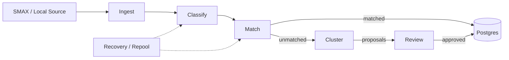

# ARCHITECTURE — AI Incident Classifier

## Service flow

## Service blocks (one folder per pipeline stage)

| Service | What it does | Folder |
|---|---|---|
| **Ingest** | HTTP API: classify/incidents/reports/import/reset endpoints, E1-E9 integration API (async ingest, bearer auth), import service, status monitor | `ai_classification/services/ingest/` |
| **Classify** | LLM classification cascade (system → service → offering), taxonomy validation, PROMPT_VERSION, frozen prompts | `ai_classification/services/classify/` |
| **Match** | Similarity + exemplar matching: embeddings, feed_incident, offering_of, MATCH_THRESHOLD | `ai_classification/services/match/` |
| **Cluster** | Clustering engine: volume-adaptive sensitivity, offering/sub-offering grouping, LLM Arabic naming (fingerprint cache), proposals | `ai_classification/services/cluster/` |
| **Review** | Human-gated proposal approval / minting + GET /proposals (review UI backing) | `ai_classification/services/review/` |
| **Jobs** | Background + manual batch work: recovery, repool, reclassify_offerings, heal sweep, sync worker, async ingest worker | `ai_classification/services/jobs/` |

**Shared infrastructure** (not services): `ai_classification/shared/` — `store.py` (Postgres + pgvector, lifespan + worker wiring), `config.py` (env-based, fail-loud).

**Seams** (kept as-is, deliberate isolation): `ai_classification/seams/` — port.py, local_source.py, smax/ (client, models, real_source), pipeline.py. The rest of the codebase never sees SMAX names.

**Domain** (kept as-is): `ai_classification/domain/` — shared models (Incident, PipelineResult, ClassificationResult, taxonomy).

**Legacy (intentionally untouched):** `ai_classification/core/failure_modes.py` — the frozen FM taxonomy (internal identifiers only, not the product taxonomy; offerings are).

## Where do I look?

| Symptom | Service |
|---|---|
| Wrong offering / service picked | `services/classify/` (cascade + validator) |
| LLM calls fail / slow / wrong key | `services/classify/llm.py`, `shared/config.py` |
| Ticket not joining a cluster | `services/match/` (exemplar match) or `services/cluster/` (grouping) |
| Cluster names wrong / English / stale | `services/cluster/grouping.py` (LLM Arabic naming + fingerprint cache) |
| Proposals stuck or minting | `services/review/` + `frontend/dashboard/review.html` |
| Fallback/offering-less tickets | `services/jobs/recovery.py` (manual) / `repool.py` (continuous) |
| Async ingest job stuck (retryable/flagged) | `services/jobs/integration/` + `api/integration.py` |
| DB / persistence / pool issues | `shared/store.py` |
| API returns wrong status / auth | `app.py` + `api/integration.py` |
| SMAX / ticketing connectivity | `seams/smax/` |

## Contracts

Each service folder has a `CONTRACT.md` (input / output / dependencies / callers / invariants / entry point):

- `services/jobs/CONTRACT.md`, `services/review/CONTRACT.md`
- `services/cluster/CONTRACT.md`, `services/match/CONTRACT.md`
- `services/classify/CONTRACT.md`, `services/ingest/CONTRACT.md`, `shared/CONTRACT.md`

## Tests

Mirror the services: `tests/services/{classify,ingest,match,cluster,jobs,review}/` + `tests/shared/`. Run: `PG_PORT=5432 uv run pytest tests/ -q` (the suite refuses to run against the production DB; it forces `ai_incidents_test`).
