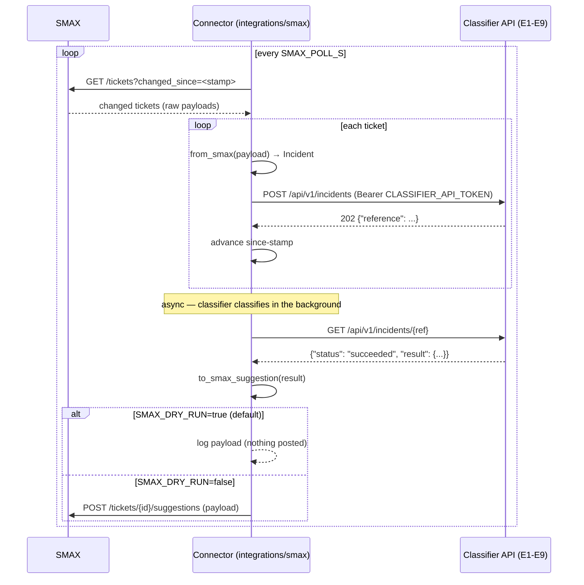

# SMAX Ticketing Connector (`integrations/smax`)

The standalone connector between the **SMAX ticketing system** (upstream) and the
**AI incident classifier** (downstream). It runs as its **own process** and talks
to the classifier **only through its public HTTP API** — it imports *nothing* from
`ai_classification` and can be deployed on a machine that has only network access
to the classifier API.

```
┌──────────┐   changed tickets    ┌────────────────────┐   POST /api/v1/incidents   ┌──────────────┐
│   SMAX   │ ───────────────────► │  integrations/smax  │ ─────────────────────────► │  Classifier  │
│ (upstream)│ ◄─────────────────── │     (connector)     │ ◄───────────────────────── │  (E1–E9 API) │
└──────────┘  suggestion payload  └────────────────────┘   GET /api/v1/incidents/{ref}└──────────────┘
```

## What it does

1. **Poller** (`poller.py`) — every `SMAX_POLL_S` seconds, list SMAX tickets
   changed since the local since-stamp (`SMAX_SYNC_STAMP_PATH`), translate each
   with `from_smax`, and submit it via `POST /api/v1/incidents` (async ingest).
   Advance the stamp to the newest `updated_at`. The stamp is **runtime state,
   never committed to git**; idempotency comes free from the server
   (content-hash + `source_reference` dedupe).
2. **Write-back** (`writeback.py`) — for each submitted reference, poll
   `GET /api/v1/incidents/{ref}` until the result is ready, build the SMAX
   suggestion payload with `to_smax_suggestion`, and post it to the SMAX side
   channel. **Dry-run by default** (`SMAX_DRY_RUN=true`): the payload is logged,
   never posted.

## Run it

```bash
# From the repo root (env-driven, no code config):
export SMAX_API_URL=https://smax.example.com
export SMAX_API_TOKEN=secret
export CLASSIFIER_API_URL=http://localhost:8000
export CLASSIFIER_API_TOKEN=secret   # same as the server's INTEGRATION_API_TOKEN
export SMAX_DRY_RUN=true             # default: log only, post nothing

.venv/bin/python -m integrations.smax.main
```

One-shot modes:

```bash
# Print the resolved config (tokens masked) — no network needed:
.venv/bin/python -m integrations.smax.main --check

# One poll tick + one write-back sweep, then exit:
.venv/bin/python -m integrations.smax.main --once

# Historical backfill from a JSON file of incidents (chunked ≤200/call):
.venv/bin/python -m integrations.smax.main --backfill incidents.json --since 2025-01-01T00:00:00Z
```

`incidents.json` is a JSON list (or `{"incidents": [...]}`) of normalized
incidents `{source_reference, title, description, status?, created_at?, updated_at?}`
— raw SMAX payloads (keys like `ticket_id`/`title`) are also accepted and
translated with `from_smax`.

## Environment variables

| Variable | Default | Purpose |
| --- | --- | --- |
| `SMAX_API_URL` | *(unset — required)* | Base URL of the SMAX REST API. |
| `SMAX_API_TOKEN` | *(unset — required)* | Bearer token for SMAX. Connector refuses to start without it. |
| `SMAX_DRY_RUN` | `true` | `true` → write-back only LOGS the suggestion payload; `false` → posts to SMAX. |
| `SMAX_POLL_S` | `60` | Poll interval (seconds) for the SMAX change poller. |
| `SMAX_SYNC_STAMP_PATH` | `./.last_sync` | Local since-stamp file (runtime state; never committed). |
| `SMAX_WRITE_BACK` | `suggestions` | `none` → never write; `suggestions` (default) → SMAX side channel; `full` → same write path (the connector never mutates ticket fields directly). |
| `CLASSIFIER_API_URL` | `http://localhost:8000` | Base URL of the classifier's public API. |
| `CLASSIFIER_API_TOKEN` | *(unset — required)* | Bearer token for the classifier API — the server's `INTEGRATION_API_TOKEN`. Refuses to start without it. |

## Sequence diagram



## Tests

```bash
PG_PORT=5432 .venv/bin/pytest integrations/smax/tests/ -q
```

Unit tests only: fake SMAX + fake classifier HTTP servers on ephemeral ports
(`http.server.ThreadingHTTPServer`), no network, no LLM, no `ai_classification`.

## Containment

This package is standalone by construction: `grep -rn "ai_classification" integrations/`
must return nothing (except README prose). Enforced in CI like the pre-existing
containment grep for SMAX field names.
